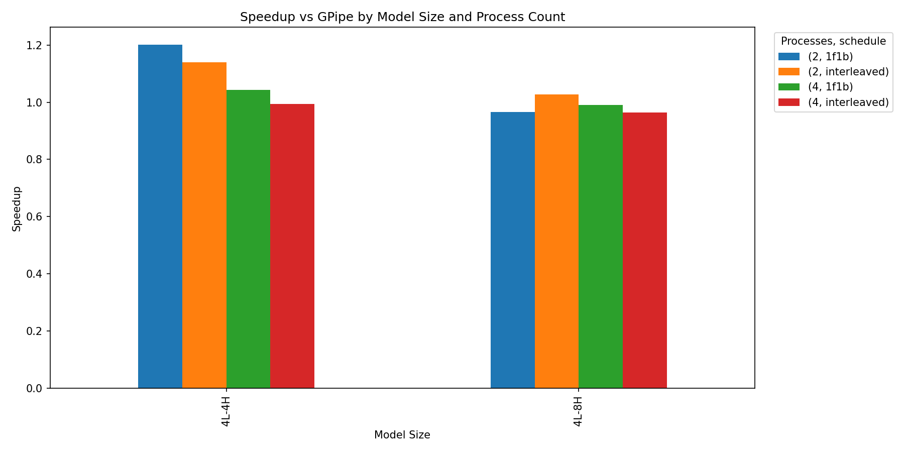
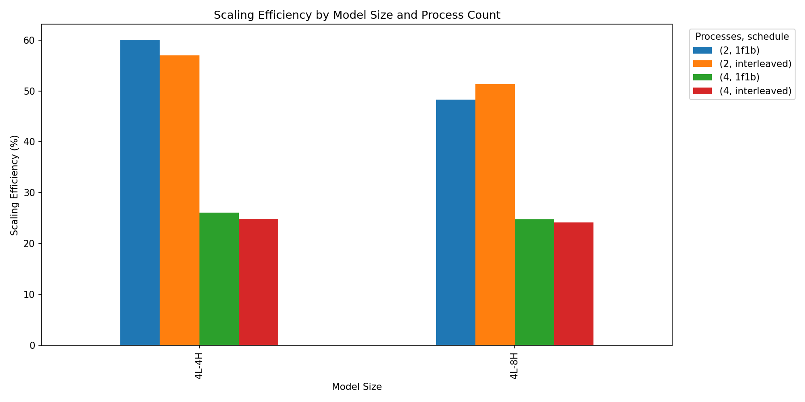

# Pipeline Parallelism: Benchmarking GPipe, 1F1B & Interleaved for Distributed Training (CPU)

This repo compares GPipe, 1F1B, and Interleaved-1F1B pipeline schedules using PyTorch’s
`torch.distributed.pipelining` with CPU distributed training. It provides a CLI runner, a small grid sweep,
and an analysis script that turns CSV into plots for speedup vs GPipe and scaling efficiency.


---

## Pipeline parallelism and pipeline bubbles:

**Pipeline parallelism** does two things:

1) Stage the model: split the network into $K$ sequential stages and assign consecutive layers to ranks (GPUs/CPUs) `0..K-1`.  
   Each stage runs forward/backward for its layers only.

2) Split the global batch into M micro-batches and inject them sequentially through the pipeline.

**Pipeline bubbles** are the idle gaps when a stage can’t do useful work (e.g., waiting for inputs/gradients). Lower utilization ⇒ lower throughput.

Let one “tick” be the time for one stage to do one forward or one backward on one micro-batch.
- Forward fill bubble (K−1 ticks): At `t=0` only stage 0 works on μ₁ and the other stages wait. After each tick μ₁ advances one stage and more stages begin working. The tail stage starts only after μ₁ reaches it.
- Forward drain bubble (K−1 ticks): After stage 0 finishes μ_M, it has nothing left to start and goes idle. On the next ticks stage 1 finishes μ_M and idles, then stage 2, and so on until the tail completes μ_M.
- Backward fill bubble (K−1 ticks): Backward begins at the tail on μ_M while upstream stages wait for gradients to arrive.
- Backward drain bubble (K−1 ticks): Gradients for μ₁ climb back toward the head, and downstream stages become idle one by one until stage 0 finishes μ₁.

These bubbles add roughly `O(K)` fixed cost per mini-batch. The schedules below reduce that impact by overlapping work and by bounding activation memory.

---

## Schedules & trade-offs

### GPipe
- Idea: Use many micro-batches ($M ≫ K$) so the pipeline fills quickly and stays full. All forward passes are pipelined first, then all backward passes are pipelined. With M micro-batches in flight, stages stay busy after a short warm-up because each stage is always receiving the next micro-batch.
- Bubbles and timing: There is an initial forward fill (about K−1 ticks) before the tail can start, and a forward drain (about K−1 ticks) after the head finishes its last forward. The same pattern repeats for backward. Because M is large, those fixed K-dependent gaps are amortized over many micro-batches, so the fraction of time lost to bubbles shrinks as M grows.
- Memory: Each stage must retain activations for every micro-batch until its backward arrives, so activation memory scales as O(M). This makes GPipe simple and effective when you can afford larger activation footprints or use activation checkpointing.


### 1F1B
- Idea: After a short warm-up, each stage alternates one forward and one backward. As soon as the tail finishes the forward of μ₁, it immediately begins the backward of μ₁ while the head continues feeding new forwards. Forward and backward waves interleave through the pipe. Downstream stages are doing backward on early micro-batches while upstream stages advance forward on later ones. The head doesn’t have to finish all forwards before any backward can start, and the tail doesn’t sit idle waiting for all forwards to complete.
- Bubbles and timing: The overlap removes the large “middle” idle regions. You still pay the initial forward fill and the final backward drain (about K−1 ticks each), but the long gap between forward and backward phases largely disappears, improving utilization at a fixed M.
- Memory: Activations are held only until the corresponding backward returns, which is bounded by the pipeline depth, so activation memory scales as O(K). This is the primary advantage over GPipe when memory is tight or when you cannot raise M.

  
### Interleaved-1F1B (with virtual stages)
- Idea: Split each physical stage into v smaller, sequential “virtual stages,” producing K·v shorter stages overall. Micro-batches traverse chunk 0 on all ranks, then chunk 1 on all ranks, and so on, while still following the 1F1B alternation.  By shortening each stage, the time to move a micro-batch from head to tail (and back) drops. The pipe fills and drains faster because each hop is cheaper, and more fine-grained stages keep ranks busier between alternated forward and backward steps.
- Bubbles and timing: Fill and drain latencies shrink approximately in proportion to 1/v, so the fixed bubble time is reduced without having to increase M. This is especially helpful when M cannot be made very large due to memory constraints or latency goals.
- Memory: Like 1F1B, activation memory remains bounded by O(K) because backward begins promptly relative to when forward produced the activations, independent of M.

---

## Why compare on **CPU distributed training**?

- We use **`gloo`** backend with **multiple CPU processes** (via `torchrun`), so results capture schedule overheads **without** GPU/NCCL effects.
- On CPU, **communication and synchronization** are relatively expensive; **compute per stage** is smaller.  
  This shifts sweet spots (e.g., interleaving may help at **P=2** for wider models but not at **P=4**, where overhead dominates).  
- On GPUs with **NCCL** and larger compute per stage, crossover points can move (1F1B/interleaving often win more broadly).

---

## Setup:
> Note: `scripts/analyze_grid.py` expects a results CSV at `results/pp_results_fast.csv`.  
> If you don’t have one yet, either run the grid (see below) or copy a CSV into `results/`.

Option 1: local run
```bash
python -m venv .venv && source .venv/bin/activate
pip install --upgrade pip
# PyTorch CPU:
pip install --index-url https://download.pytorch.org/whl/cpu "torch==2.8.*" torchvision torchaudio || \
pip install "torch==2.8.*" torchvision torchaudio
pip install -r requirements.txt
python scripts/analyze_grid.py
```

Sanity command:
```bash
python -m torchrun --standalone --nproc_per_node=2 scripts/pp_runner.py \
  --schedule gpipe --n-layers 4 --n-heads 4 --dim 240 \
  --seq-len 64 --batch-size 8 --microbatches 4 \
  --threads 1 --warmup-steps 0 --measure-steps 1 --emit-csv
```


Option 2: Docker (build locally):
Make sure Docker Desktop is running (macOS/Windows) or run `colima start` (Homebrew).
```bash
docker build -t pp-bench:cpu .
docker run --rm -it pp-bench:cpu
docker run --rm -it -v "$PWD/results:/app/results" pp-bench:cpu \
  python scripts/analyze_grid.py
```

Option 3: pull a prebuilt Docker image 
```bash
docker pull layanneelassaad/pp-bench:cpu-v0.1 
docker run --rm -it layanneelassaad/pp-bench:cpu-v0.1
docker run --rm -it -v "$PWD/results:/app/results" layanneelassaad/pp-bench:cpu-v0.1 \
  python scripts/analyze_grid.py
```
---

## Results:
| Model | Procs (P) |      GPipe |       1F1B | Interleaved | Winner          |
| ----- | --------: | ---------: | ---------: | ----------: | --------------- |
| 4L-4H |         2 |     623.89 | **749.93** |      710.74 | **1F1B**        |
| 4L-4H |         4 |     878.28 | **916.92** |      873.83 | **1F1B**        |
| 4L-8H |         2 |     729.22 |     703.81 |  **749.00** | **Interleaved** |
| 4L-8H |         4 | **924.42** |     915.20 |      891.74 | **GPipe**       |


Scaling efficiency (selected):

P=2 ≈ 50–60%

P=4 ≈ 24–27%

## Analysis (CPU / gloo)

<p align="center">
  
 
</p>

<p align="center">
  Figure 1: Speedup vs GPipe
 
</p>


For the 4L-4H model at P=2, 1F1B delivers about 1.20× GPipe while Interleaved is 1.13×. This matches the intuition that when each pipeline stage is relatively cheap, alternating forward and backward quickly erases the middle bubbles and keeps ranks busy with minimal coordination cost. At P=4 on CPU, the advantage narrows. 1F1B is only about 1.04× and Interleaved drops to parity around 1.00×. The extra barriers and hand-offs introduced at higher process counts eat into the gains that overlap provides.

For the 4L-8H model, widening increases per-stage compute a bit. At P=2, Interleaved edges ahead at 1.03× GPipe, while 1F1B dips slightly below around 0.96×. Splitting each stage into virtual chunks keeps the pipeline better utilized at small P by shortening stage latency and reducing the visible bubble. However, at P=4 both 1F1B around 0.99× and Interleaved around 0.97× fall behind GPipe on CPU because extra cross-rank transfers and more synchronization dominate at larger P.

On CPU, 1F1B is best for small or deeper configurations at P=2 and it is still slightly ahead at P=4 when stages are cheap as in 4L-4H. Interleaved can win at P=2 for wider models like 4L-8H by adding virtual stages, but at P=4 its extra hand-offs negate the benefit and GPipe becomes competitive or best.

---
<p align="center">
 
 </p>

 <p align="center">
  Figure 2: Scaling efficiency (%)
 
</p>
At P=2 the winners sit near 50–60 percent efficiency for example 4L-4H with 1F1B is about 60 percent. Wider 4L-8H models are slightly lower around 48–51 percent which reflects more per-stage compute. At P=4 efficiency drops to about 24–27 percent across schedules. With the gloo backend on CPU, tokens per second still rises but barrier latency, context switches and tensor hand-offs grow faster than useful work per stage.

Going from 2 to 4 processes increases throughput but scales poorly on CPU at roughly 25 percent efficiency because communication and synchronization dominate. At P=2 both 1F1B and Interleaved maintain roughly 50–60 percent. At $P=4$ their scheduling advantages are largely eaten by overhead.

A forward-then-backward pipeline of $M$ micro-batches costs ≈ `2M + 2(K−1)` ticks. 1F1B overlaps the middle bubbles, reducing the fixed `O(K)` overhead. Interleaved shortens fill/drain by `1/v` with virtual stages. On CPU, the added inter-rank hand-offs at higher $P$ can outweigh those savings.

## CPU impact (why these patterns show up)

GPipe: Fewer cross-rank hand-offs and simpler coordination per unit of useful work. At higher process counts this smaller communication footprint can outweigh bubble costs, which matches the cases where GPipe is competitive or best.

1F1B: Alternating forward and backward introduces more frequent synchronization than GPipe. At small process counts the overlap benefit dominates and we see clear wins. At higher process counts on CPU, extra barriers and context switches reduce or erase the advantage.

Interleaved: Splitting into v virtual stages reduces fill and drain time but increases cross-rank hand-offs by about v. At small process counts and with wider models this keeps ranks busy and can win. At higher process counts on CPU the extra sends/receives and scheduling overhead offset the bubble savings, leading to parity or a small deficit.

System effects on CPU: gloo has higher per-message latency than NCCL; multi-process training adds barrier and context-switch overhead; compute per stage is smaller so the compute/communication ratio is worse; NUMA and memory bandwidth contention can add variability; and per-micro-batch overheads (autograd bookkeeping and dispatcher costs) are non-trivial. Together these increase the fixed costs that don’t shrink with model size, explaining the drop from roughly 50–60 percent efficiency at two processes to roughly 24–27 percent at four processes.


**Implication.**  
On CPU, increasing process count raises tokens per second but scales poorly because communication and synchronization overheads grow faster than useful compute per stage. Hence the pattern you see: 1F1B wins at small process counts thanks to overlap and limited communication. Interleaved helps at P=2 for wider models since more virtual stages keep ranks busier. At P=4 the extra hand-offs flatten or reverse the gains and GPipe’s simplicity becomes competitive.


